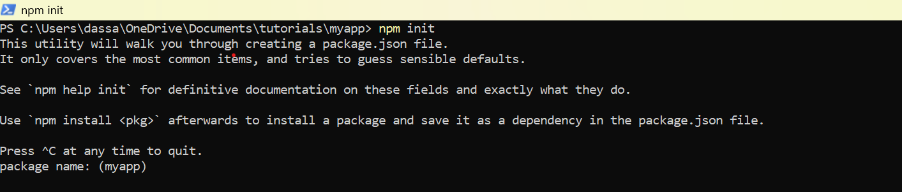
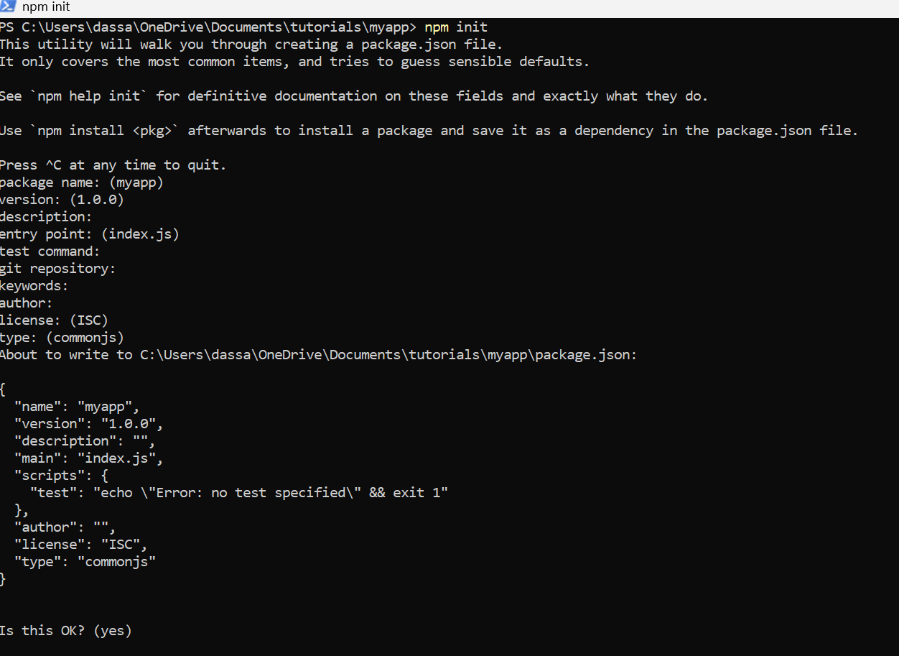
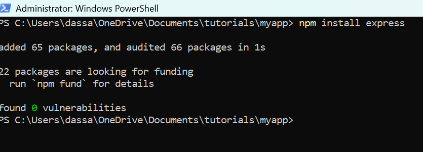
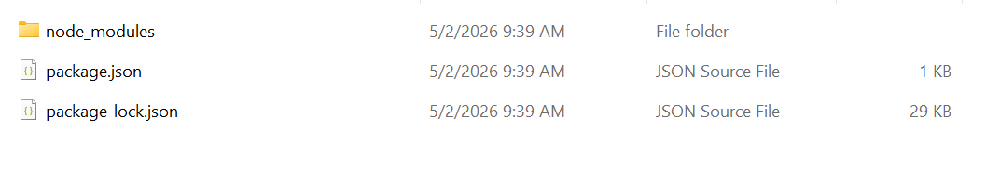

# Andrew Dass CAT API Project

## What this Project Is
This project uses an API from the website called "TheCatAPI" https://account.thecatapi.com/ (1) to retrieve an image of a cat, the breed it is, a description of the cat and its emotional qualities. 

## Technologies Used:
* HTML
* CSS
* JavaScript
* Node.js
* Express.js 
* npm-cron

## Softwares to Download to Run the Project
Three softwares are needed to run this project, node.js (2), a node.js backend framework called express.js (3) and node-cron (4) a program that executes other programs on a set schedule. It's recommended to download node.js first because express.js is an extension of node.js and node-cron is a program that also belongs to node, meaning both of them relies on node.js to function properly. 

### Downloading Node.js
The directions to install node.js is different on each machine, and its best to visit their official website and follow the directions to download the software and other softwares may be needed prior to downloading node.js as well. After downloading node.js, you should see additional files in the root directory such as package.json, package-lock.json and a folder called node_modules and can run a command called "npm" in the terminal. Afterwards, then download express.js (3). 

### Downloading Express.js
There are general steps to downloading express.js. In the root directory where the node commands are ran, then install the express.js in the same directory. Below are the commands in sequential order to run express.js:

` npm init `

After running npm init, the prompt will ask the user to customize the application to their liking by asking the following:

Package name : In parenthesis is the name of the folder that npm init was ran in

version: Shows the current version

description: Can add an explanation to describe the purpose of this project or application

entry point: This is the name of the file that will run the express framework. By default, the name of the file is index.js and it can be changed during installation or after installation.

test command: This is the code in the terminal that is responsible to start running the express application. If left blank, then to run the express is done by executing `node name_of_file.js`

git repository: Can customize where to push this code to a certain git repository, though this can be left blank and later after finishing the project, the code can still be pushed. 

keywords: Important commands or words relevant to this particular project, whether it is to understand it or execute it. 

author: The name of the person who created the application can be written here.

license: ISC means Internet Systems Consortium, and that Node.js is an open-source software people can receive access to. 

type: By default, all files that express will look for to execute the framework is commonjs or it is looking to read a file that has a ".js" extension. This can be customized to a different setting to look for a different file with a different extension. In this project, it is left as commonjs.

After completing the prompt, it will download node.js.

After installing node in the directory, two files and a folder is created: package.json, package-lock.json and node_modules. If any changes need to be made to the previous prompt created by `npm init`, modify the package.json file. package-lock.json should not be edited, as it contains code and information related to licensing and the node version. The node_modules folder is responsible for making additional modules that can be imported work in node, such as express.js. 

If you have trouble downloading once again, visit the official express.js website to download the software.

### Downloading Node-Cron
To download node-cron (4), run the following command: 
`npm install node-cron`

## Steps to Running the Application

### Receiving a CAT API Key
To use the cat api, make an account on the cat api website and select the free option to not pay for charges: https://account.thecatapi.com/ (1). After making an account, there should be a header that says "API Keys". Navigate to that page and follow the directions to make a cat API key and this key will be used to retrieve a cat information. Make sure no one else gets ahold of this key. 

### How the API Key is Modified for this Project
Also go to the TheCatAPI - Documentation Portal (5), there they explain how to customize the first part of the url for the API link and how to add other symbols in the link, including & signs and how to include the second part of the api link that was generated from the user's account.

By following the CAT api documentation, the url to parse cat information can be modified to obtain certain data about cats. 

**Below shows the API Format used in this project (copy this):**

`https://api.thecatapi.com/v1/images/search?has_breeds=1&api_key=...`  
where ... is inserting api_key generated from user account

### Inserting the API Key into the Express.js file
Now, open the express.js file in the root directory. The source code has been uploaded without an api_key and to use this application, the variable called `const apiString` needs to be set to the users cat api key they recently created. Insert the generated cat api key as a string data type and set it equal to const apiString. 

Afterwards, this file can be run by performing "node express.js".

### What you should see when executing the Cat Application
Upon opening this js file and the node command, it will load automatically load the name or breed of the cat, an image of a cat, a descripton of it and its emotional qualities. If you would like to see another cat, please rerun or restart the express server and access the express application on the internet browser to see a new cat.

## How this Project Works and why these Project Files is Structured the way they are
This repository contains many files, the root directory contains: express.js, package.json, package-lock.json, node_modules, and another folder called public. The public folder has more files that express.js connects to, which contains the files index.html, index.css, index.js, datafile.js and catFavicon.ico.

The express.js file contains the fetch API to retrieve the cat information from the "TheCATAPI" website and then runs the code needed to start the express server. The reason the fetch API is included in the express.js file because express.js is a backend framework, meaning when the application server is deployed to the internet, this file's content cannot be inspected through the console. This is necessary for protecting our api key from other users. The information that is needed from the api is sent to the datafile.js as a dictionary, and datafile.js's information is available to be exported, and index.js imports that data. Express cannot use DOM feature therefore, the api data information had to be sent to another file that is on the frontend side of the application to be changed by DOM. The index.js populates the index.html with the information it retrieves from dataFile.js by using DOM.

## Accessing Application From Express on Internet Browser
localhost:3000 or localhost:3000/index.html

## Sources
https://account.thecatapi.com/ (1)

https://nodejs.org/en (2)

https://expressjs.com/ (3)

https://www.npmjs.com/package/node-cron (4)

https://developers.thecatapi.com/view-account/ylX4blBYT9FaoVd6OhvR?report=bOoHBz-8t (5)